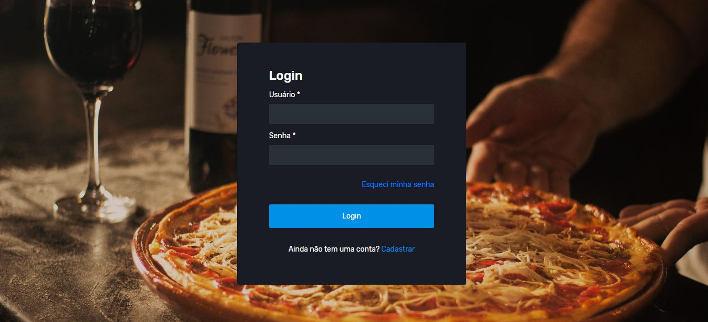
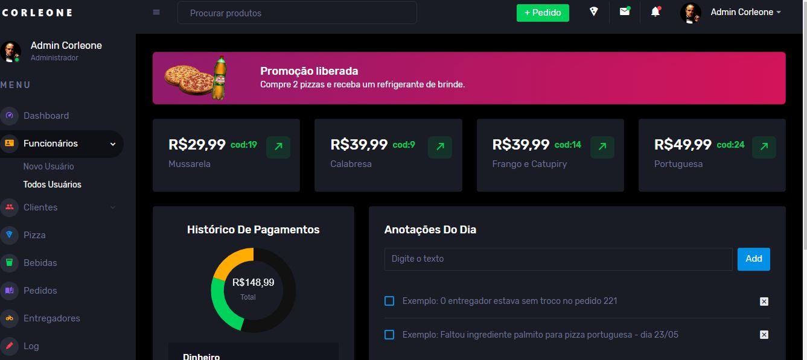
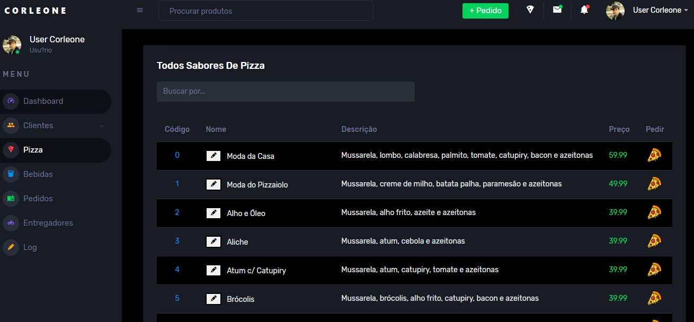
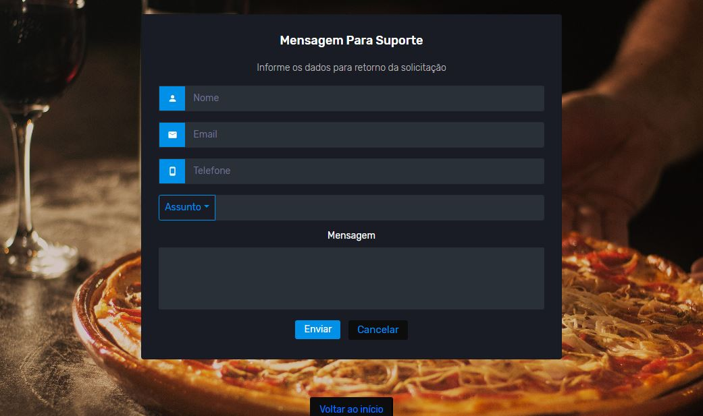

<h1 align="center">Corleone-Pizza</h1>

<h3 align="center">Aplicação para uma pizzaria, com todos produtos, sessão de controle, cadastro de clientes e pedidos.</h3>

 

<a href="https://corleone-pizza.herokuapp.com/corleone-pizza/">https://corleone-pizza.herokuapp.com/corleone-pizza/</a>

 

Login: admin / Senha: admin
 
Login: user / Senha: user
 
Login: teste / Senha: teste

 

  

  
<strong>App</strong>

  

   
  <ul>
    <li>Validação com banco de dados, login/senha.
    </li>
   <li>Validação para não acessar nenhuma página do sistema sem estar logado.
    </li>
    <li>
      O usuário 'admin' tem acesso total ao sistema, somente admin pode registrar usuários novos, produtos novos e alterar o preço/descrição.
    </li>
    <li>
      O usuário pode alterar o nome dos produtos apenas para estudo, na página log de sistema consta qual usuário fez a modificação.
    </li>
    <li>
      CRUD completo do cadastro de clientes.
    </li>
    <li>
      CRUD completo do cadastro de usuários  
    </li>
    <li>
      Parte de configurações de usuário com Upload de foto de perfil, salvando no banco de dados.
    </li>
    <li>
      Exibir lista de forma dinâmica de clientes e produtos.
    </li>
    <li>
      Realizar pedido - checkout com produtos e dados do cliente.
    </li>
    <li>
      Realizar pedido - relacionamentos pedido/cliente/produto no banco de dados ao finalizar o pedido.
    </li>
    <li>
      Página de pedido - pedido finalizado fica no histórico de pedidos.
    </li>
    <li>
      Envio de Whatssap para clientes para notificar algo sobre seu pedido.
    </li>
    <li>
      Página de entregadores com crud completo
    </li>
    <li>
      Envio de emails na página inicial (cadastrar) funcionando corretamente
    </li>
     
    <li>
      O sistema não foi pensado em regra de negócio, organização do código e nem em performance,
      foi pensado mais em aprendizado de códigos, compreensão e consultas posteriores.
    </li>
  </ul>

  

   
  

    

    
<strong>Imagens</strong>

     
    

    
    

    
    

    
    

    
    

    
    

    
    

 

<h3>Tecnologias utilizadas</h3>

HTML, CSS, JS, Bootstrap, JQuery, Java Servlet, JSP, JDBC, PostgreSQL, Jackson, AJAX, Maven, Tomcat 9, Git e Github

 

